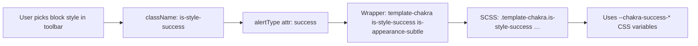

# AlertsDLX — Styles & Alert Types

How visual styling works across the four alert groups (Bootstrap, Chakra, Material, Shoelace): from **alert type** (semantic color) through **variants**, **modes**, and **custom colors**.

---

## Core concepts

Styling is driven by three block attributes that combine as **CSS classes** on a wrapper element:

| Attribute    | Role | CSS class pattern | Example |
|--------------|------|-------------------|---------|
| `alertType`  | Semantic color / “alert style” (success, danger, etc.) | `is-style-{alertType}` | `is-style-success` |
| `variant`    | Layout / visual treatment within a theme | `is-appearance-{variant}` | `is-appearance-solid` |
| `mode`       | Light or dark palette | `is-dark-mode` when dark | (class omitted in light mode) |

Every alert also has:

- **`alertGroup`** — which theme is active: `bootstrap`, `chakra`, `material`, or `shoelace`
- **Wrapper classes** — `alerts-dlx template-{alertGroup}` on the outer container (editor + frontend)
- **Inner figure** — `alerts-dlx-alert alerts-dlx-{alertGroup}` on the `<figure>` element

On the **frontend**, PHP (`Blocks::frontend()`) outputs the wrapper roughly as:

```html
<div class="alerts-dlx template-chakra is-style-info is-appearance-subtle aligncenter">
  <figure class="alerts-dlx-alert alerts-dlx-chakra alerts-dlx-has-icon" id="…">
    …
  </figure>
</div>
```

In the **editor**, each theme’s `edit.js` builds the same class list via `useBlockProps()` so the canvas matches the frontend.

---

## Alert types vs WordPress block styles

Each block declares **block styles** in `block.json` under `"styles"`. These are the presets shown in the block toolbar (Styles panel / style picker).

The selected block style:

1. Adds a WordPress class `is-style-{name}` to the block wrapper
2. Is synced to the **`alertType`** attribute in `edit.js` (regex on `className` → `setAttributes({ alertType })`)

So **`alertType` and `is-style-*` should always agree**. Block transforms between themes remap both when switching blocks.

### Alert types per group

| Alert group | `alertType` values | Default in `block.json` |
|-------------|-------------------|-------------------------|
| **Bootstrap** | `primary`, `secondary`, `success`, `danger`, `warning`, `info`, `light`, `dark`, `custom` | `success` (block style default is `primary`) |
| **Chakra** | `success`, `info`, `warning`, `error`, `custom` | `success` |
| **Material** | `success`, `info`, `warning`, `error`, `custom` | `success` |
| **Shoelace** | `primary`, `success`, `neutral`, `warning`, `danger`, `custom` | `success` (block style default is `primary`) |

`custom` is special: it does not use the SCSS palette maps for that type. Instead, colors come from block **color attributes** overridden at runtime (see [Custom alert type](#custom-alert-type)).

---

## How SCSS applies alert types

Each theme has one compiled stylesheet in `dist/`:

| Source | Output |
|--------|--------|
| `src/scss/bootstrap/styles.scss` | `dist/alerts-dlx-bootstrap-styles.css` |
| `src/scss/chakra/styles.scss` | `dist/alerts-dlx-chakra-styles.css` |
| `src/scss/material/styles.scss` | `dist/alerts-dlx-material-styles.css` |
| `src/scss/shoelace/styles.scss` | `dist/alerts-dlx-shoelace-styles.css` |

All import `src/scss/common.scss` for shared layout (buttons, icon grid, typography helpers).

### Pattern used in every theme

1. **SCSS maps** define hex (or derived) values per alert type, often split into **light** and **dark** palettes.
2. **Mixins** (e.g. `bootstrap-variant-css-vars`, `chakra-css-vars`) emit CSS custom properties on `.template-{group}`:
   - Theme tokens: `--bootstrap-success-color`, `--chakra-info-color-light`, etc.
3. **Base layout** under `.template-{group} .alerts-dlx-{group}` (grid, padding, title size).
4. **`@each` loops** over variant names generate rules like:
   ```scss
   &.is-style-success { … }
   &.is-style-info { … }
   ```
5. **Nested `is-appearance-*`** rules inside each alert type set borders, backgrounds, and button colors for that type + variant combination.
6. **`&.is-dark-mode`** on `.template-{group}` swaps the CSS variable mixin to the dark palette map.
7. **`&.is-style-custom`** uses **override variables** (see below) with fallbacks to a default type’s theme tokens.

### CSS variable layers

| Layer | Variable prefix | Set by |
|-------|-----------------|--------|
| Theme tokens | `--{group}-{type}-color`, `--chakra-success-color-light`, etc. | SCSS maps on `.template-{group}` |
| Per-block overrides | `--alerts-dlx-{group}-color-primary`, `color-border`, `color-accent`, `color-alt`, `color-bold`, `color-light`, … | Block attributes; inline CSS when `alertType === 'custom'` |
| Sizing | `--alerts-dlx-{group}-base-size`, `--alerts-dlx-base-font-size` | Inline `#uniqueId` styles from `baseFontSize` |

Preset alert types read **theme tokens** in SCSS, e.g.:

```scss
background-color: var(--bootstrap-success-color-light);
color: var(--bootstrap-success-color);
```

Custom and editor overrides read **override variables** first:

```scss
background-color: var(--alerts-dlx-chakra-color-light, var(--chakra-info-color-light));
```

Block attribute defaults in `block.json` point at override variables with hex fallbacks, e.g.:

```json
"colorPrimary": { "default": "var(--alerts-dlx-bootstrap-color-primary, #084298)" }
```

---

## Variants per alert group

`variant` controls structure (accent bars, solid fills, centered layout). It is **independent** of `alertType` (color).

| Alert group | `variant` options | Notes |
|-------------|-------------------|--------|
| **Bootstrap** | `default`, `centered` | Icon vertical alignment hidden when `centered` |
| **Chakra** | `subtle`, `solid`, `left-accent`, `top-accent`, `centered` | `solid` uses extra solid-* tokens in chakra maps |
| **Material** | `default`, `outlined`, `filled`, `centered` | `enableDropShadow` only applies to `default` |
| **Shoelace** | `default`, `left-accent`, `top-accent`, `centered`, `solid` | Default in `block.json` is `top-accent` |

Editor classes: `is-appearance-{variant}` (e.g. `is-appearance-outlined`).

SCSS targets combinations such as:

```scss
.template-material.is-style-info.is-appearance-outlined .alerts-dlx-material { … }
```

---

## Light / dark mode

`mode` attribute: `light` | `dark`.

- Editor: `is-dark-mode` class on the block wrapper when `mode === 'dark'`
- SCSS: `.template-{group}.is-dark-mode` re-runs the dark palette mixin so all `is-style-*` rules pick up dark token values

Bootstrap and Chakra expose a Light/Dark toggle in the inspector. Material and Shoelace follow the same class/mixin pattern.

---

## Custom alert type

When `alertType === 'custom'`:

1. **SCSS** — Rules under `&.is-style-custom` use `--alerts-dlx-{group}-color-*` variables (not the preset type maps).
2. **Editor** — `custom-colors.js` adds an Inspector **Styles** panel with `PanelColorSettings` when the block is custom; updates `colorPrimary`, `colorBorder`, etc.
3. **Editor preview** — Inline `<style>` on `#uniqueId` sets override variables from attributes (same as custom-colors).
4. **Frontend** — `Blocks::frontend()` prints inline CSS on `#uniqueId` for all nine color attributes when `alertType === 'custom'`, then enqueues `alerts-dlx-custom-css`.

Preset types ignore those color attributes for theming unless you switch to **Custom** in the block style picker.

---

## Alert types → SCSS maps (where to edit colors)

To change preset colors for a type, edit the **palette maps** in the theme’s `styles.scss`:

### Bootstrap (`src/scss/bootstrap/styles.scss`)

- `$bootstrap-variants`: `primary`, `secondary`, `success`, `danger`, `warning`, `info`, `light`, `dark`
- `$bootstrap-light-palette` / `$bootstrap-dark-palette`: per-type `color`, `border`, `accent`, `alt`, `bold`, `light`
- `$bootstrap-variant-contrast`: button text colors for light/dark

### Chakra (`src/scss/chakra/styles.scss`)

- `$chakra-variants`: `success`, `info`, `warning`, `error`
- `$chakra-light-palette` / `$chakra-dark-palette`: includes solid button/close tokens for `solid` variant

### Material (`src/scss/material/styles.scss`)

- `$material-variants`: `success`, `info`, `warning`, `error`
- `$material-light-palette` / `$material-dark-palette`: nested by type → `base`, `subtle`, `outlined`, `filled` sub-keys for variant-specific button/background rules

### Shoelace (`src/scss/shoelace/styles.scss`)

- `$shoelace-light-variants` / `$shoelace-dark-variants`: `primary`, `success`, `neutral`, `warning`, `danger`
- Keys: `border`, `alt`, `bold`, `solid-*` for solid appearance

After SCSS changes, run `npm run build` to regenerate `dist/alerts-dlx-{theme}-styles.css`.

---

## Editor color pickers (custom type helpers)

Each theme has a `colors.js` next to `edit.js` listing named swatches for the custom color panel:

- `src/js/blocks/bootstrap/colors.js`
- `src/js/blocks/chakraui/colors.js`
- `src/js/blocks/material/colors.js`
- `src/js/blocks/shoelace/colors.js`

These extend `alertsDlxBlock.colorPalette` (theme.json colors) for `PanelColorSettings`.

---

## End-to-end flow (preset type)



1. User selects **Success** in block styles → `is-style-success` + `alertType: success`
2. User picks variant **Subtle** → `is-appearance-subtle`
3. Theme SCSS matches `.template-chakra.is-style-success` + appearance rules
4. Colors come from `$chakra-light-palette` map (or dark map if `is-dark-mode`)

---

## Adding or renaming an alert type

For a **new preset type** (not custom):

1. Add entry to `"styles"` in that block’s `block.json`
2. Add the type name to the theme’s `$…-variants` (or shoelace variant maps) in `styles.scss`
3. Add palette entries to light/dark maps
4. Ensure `@each` loops include the new name (they iterate the variants list)
5. Update block transforms in `index.js` if other themes should map to/from it
6. Run `npm run build`

Keep **`alertType` values identical** to block style `name` values so `is-style-*` and attributes stay in sync.

---

## Quick reference

| I want to… | Edit |
|------------|------|
| Change success green (Chakra) | `$chakra-light-palette` → `success` in `chakra/styles.scss` |
| Change which types appear in inserter | `block.json` `"styles"` array |
| Change layout (solid vs outlined) | `variant` options in `edit.js` + `is-appearance-*` rules in SCSS |
| Change custom-only colors | `custom-colors.js` + `is-style-custom` block in SCSS |
| Change frontend wrapper classes | `php/Blocks.php` → `$container_classes` |
| Change editor wrapper classes | `{theme}/edit.js` → `useBlockProps` classnames |

See also `architecture.md` for asset loading (when theme CSS is printed on frontend vs editor).
